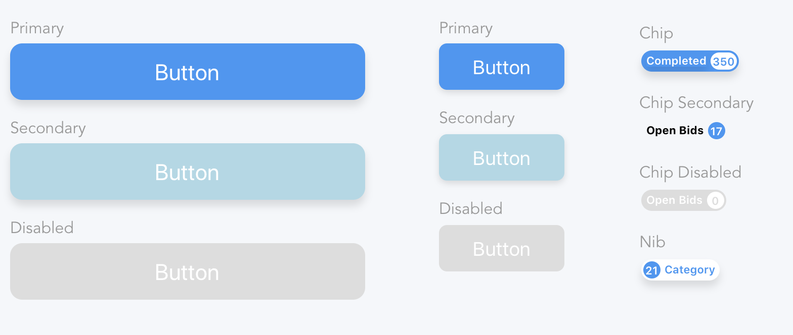
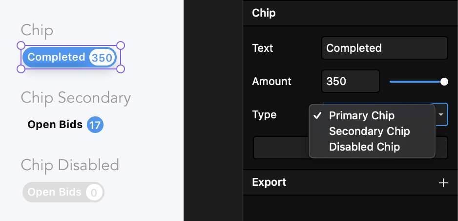

# VaporDesign

This is a design system is an ongoing project to create an attractive library of components to be used in hi-fi interactive mobile prototypes in FramerX.

## Installation

To use these components in your FramerX projects you must open a new framer project and create new code component. Use the "command + alt + p" shortcut to open the container folder for your framer project. Drag that folder into your code editor and install 'styled-components' with the npm command:

```
npm install styled-components
```

Copy the code from the desired component that you would like in your project and paste it into the file code component file that you created in the FramerX component interface

## Components



## Usage In FramerX


